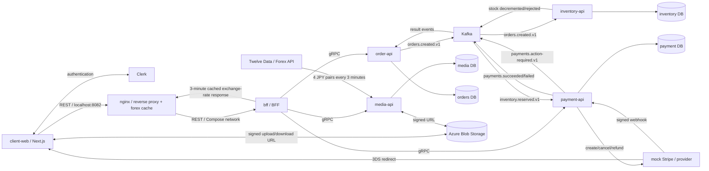

# Service architecture

```mermaid
flowchart LR
    Web[client-web / Next.js] <-->|authentication| Clerk[Clerk]
    Web -->|REST / localhost:8082| Nginx[nginx / reverse proxy + forex cache]
    Nginx -->|REST / Compose network| BFF[bff / BFF]
    BFF -->|3-minute cached exchange-rate response| Nginx
    BFF -->|gRPC| Media[media-api]
    Forex[Twelve Data / Forex API] -->|4 JPY pairs every 3 minutes| Media
    BFF -->|gRPC| Order[order-api]
    BFF -->|gRPC| Payment[payment-api]
Order -->|orders.created.v1| Kafka[Kafka]
Kafka -->|orders.created.v1| Inventory[inventory-api]
Inventory -->|stock decremented/rejected| Kafka
    Kafka -->|inventory.reserved.v1| Payment
    Payment -->|payments.succeeded/failed| Kafka
    Payment -->|payments.action-required.v1| Kafka
    Kafka -->|result events| Order
    Payment -->|create/cancel/refund| Stripe[mock Stripe / provider]
    Stripe -->|3DS redirect| Web
    Stripe -->|signed webhook| Payment
    Media --> MediaDB[(media DB)]
    Inventory --> InventoryDB[(inventory DB)]
    Payment --> PaymentDB[(payment DB)]
    Order --> OrderDB[(orders DB)]
    Web <-->|signed upload/download URL| Blob[(Azure Blob Storage)]
    Media <-->|signed URL| Blob
```

nginx is the public application API entry point and the `bff` is reachable only inside
the Compose network in local development. The BFF resolves the current product price
from `media-api` and sends the immutable price snapshot to `order-api`. Product and
asset ownership lives in `media-api`; stock mutations live in `inventory-api`; order
state lives in `order-api`.

`media-api` refreshes USD/JPY, EUR/JPY, GBP/JPY, and CNY/JPY from Twelve Data
at startup and every three minutes, retaining the last complete successful snapshot.
The BFF reads that snapshot over gRPC and exposes `GET /api/v1/exchange-rates`.
nginx caches successful responses for three minutes, and the product detail page refreshes
the four reference prices on the same interval (using the existing 1 point = 1 JPY rule).

`client-web` uses locale-prefixed routes (`/ja`, `/en`, `/fr`, `/de`, and `/zh`) through
`next-intl`. Browsing prices are shown as JPY, USD, EUR, EUR, and CNY respectively;
the locale selector displays the corresponding country flag and language name.
Non-Japanese product names are translated on demand through the server-side
`/api/translations` proxy. Successful MyMemory responses are cached for 24 hours on the
server and in TanStack Query; while a translation is pending or unavailable, the original
Japanese product name remains visible. The checkout currency remains JPY.
Japanese pages display the native point price; English storefront pages display an
estimated USD price using the cached exchange rate. Overseas checkout offers card or
bank transfer and always submits `JPY` to the BFF—the converted price is display-only.

Each service owns a separate PostgreSQL database. The databases may run on the
same PostgreSQL server and port in local development, while the database names,
migrations, and direct table access are separated. The BFF is stateless and has no business
database; purchase authorization is checked through `order-api.HasPaidOrder`.

`order-api` has no direct connection to media, inventory, or payment. It commits the
order and `orders.created.v1` outbox record atomically. Inventory consumes that event,
decrements stock immediately, and publishes the result. Payment consumes only successful decrements and
publishes its result. Order consumes both result streams to update state. A payment
failure is also consumed by inventory to perform an idempotent release. Every consumer
uses the order idempotency key, so Kafka redelivery does not duplicate stock or payment.
The order event carries both `payment_method` and `currency`; consumers never infer one
from the other. Card payments remain `processing` until a signed, provider-event-id
deduplicated webhook arrives. Point top-ups credit the point account in the same database
transaction that completes the external payment.

Kafka record handling and offset commits use a 10-second timeout per attempt. Technical
failures are retried up to six times with increasing delays of 500 ms, 1 s, 2 s, 4 s,
and 5 s. A record is committed only after successful processing. If all attempts fail,
the service shuts down so Kubernetes restarts it and Kafka redelivers the uncommitted
record. The BFF's idempotent order RPC has a 10-second overall deadline and retries
`UNAVAILABLE` up to three attempts with exponential backoff.
